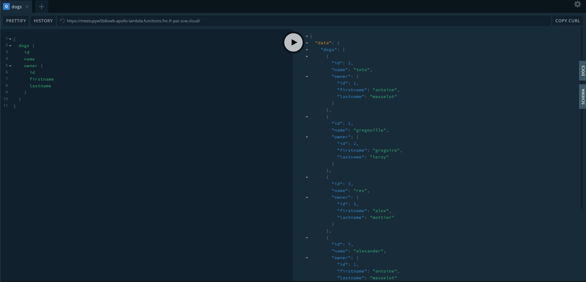

# Demonstration GraphQL back-end API with Elastic Beanstalk

This repository aims to showcase easy deployments of Node.js Applications with TypeScript and GraphQL on the AWS Elastic Beanstalk Product.

## Deploy the application

Follow the steps below to deploy this application to ElasticBeanstalk:
- Download the ZIP archive from the [Release section](https://github.com/AmFlint/elastic-beanstalk-demo/releases)
- Login to [Elastic Beanstalk Management console](https://console.aws.amazon.com/elasticbeanstalk)
- Choose `Create New Application`
- Choose Node.js for the platform, upload your zip archive at the bottom of the page
- Click `Configure more Options`, at the bottom choose `Edit Database`
- Create a RDS instance with `mysql` engine, 5GB of storage, and input a username and password
- Review and launch the application

